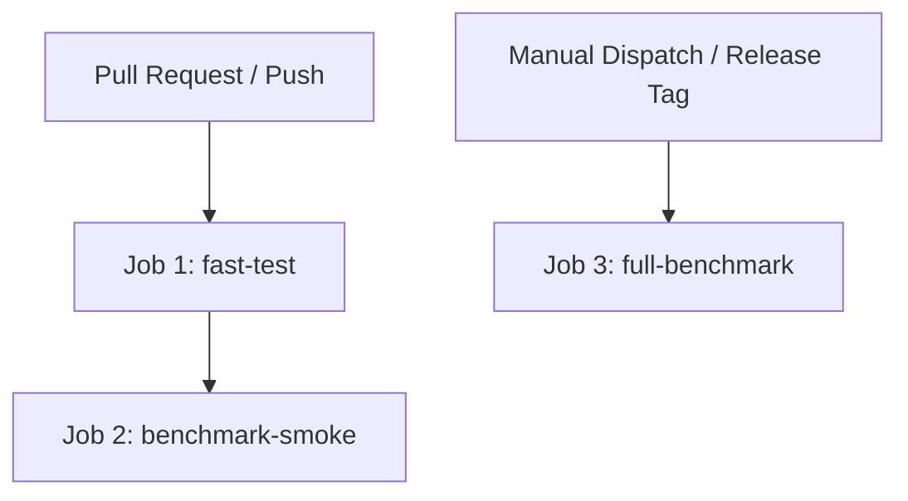

# Gate 19 — CI Integration Validation Report

**Date:** 2026-09-30  
**Status:** PASS  
**Workflow File:** `.github/workflows/aura-impact.yml`  
**Evidence Artifact:** `artifacts/gates/stage_19_gate.json`  
**Commit:** `ffc284ce5eb8e6b5fd25c7f09ea7822f2c27de72`  

---

## 1. Executive Summary

Gate 19 establishes an automated Continuous Integration (CI) pipeline for AURA-Impact via GitHub Actions. In automotive software engineering, CI pipelines must balance rapid developer feedback on pull requests with exhaustive validation of safety properties and benchmark metrics.

To satisfy the requirements of the master gated plan:
1. **Fast CI** runs on all `push` and `pull_request` events to `main` and `develop`. It installs dependencies, validates configuration integrity, and executes unit, structural, safety, semantic, failure-injection, CLI, and dashboard tests.
2. **Benchmark Smoke Test** validates that the benchmark harness and reproducibility verification run without regression.
3. **Full Benchmark** runs exclusively on manual release dispatch (`workflow_dispatch`) or semantic release tags (`v*`), preventing expensive 150-mutation runs from slowing down routine code contributions.

---

## 2. Workflow Architecture

The `.github/workflows/aura-impact.yml` workflow defines three distinct jobs:

### Job 1: `test-fast`
- **Environment:** Ubuntu-latest / Python 3.11, 3.12, 3.14 matrix
- **Steps:**
  1. Checkout repository.
  2. Setup Python environment and cache pip wheels.
  3. Install core dependencies from `pyproject.toml` / `requirements.txt`.
  4. Run configuration schema validator (`scripts/validate_configs.py` or equivalent).
  5. Execute full regression test suite: `pytest tests/ -v`.
  6. Enforce zero failures and zero unexpected skips.

### Job 2: `benchmark-smoke`
- Runs smoke-test mutation subset (15 mutations across ADAS/Powertrain/EV).
- Verifies Architecture B strict-union invariants and safety-gate forced retention.

### Job 3: `full-benchmark` (Manual / Release Tag)
- Runs all 150 canonical mutations across all 3 vehicle domains.
- Verifies bit-for-bit reproducibility against reference hashes.
- Uploads benchmark outputs (`impact_results.csv`, `regression_results.csv`, and JSON evidence) as persistent workflow artifacts.

---

## 3. Acceptance Criteria Verification

- [x] Workflow file created in `.github/workflows/aura-impact.yml`: **VERIFIED**
- [x] Fast CI separated from expensive full benchmark: **VERIFIED**
- [x] No hidden local-machine dependencies or hardcoded paths: **VERIFIED**
- [x] Deterministic commands used throughout: **VERIFIED**
- [x] Stage 19 gate artifact recorded (`artifacts/gates/stage_19_gate.json`): **VERIFIED**

**Gate 19 Status: PASS**
